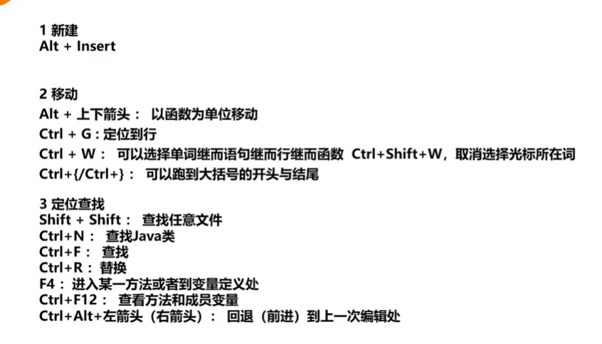
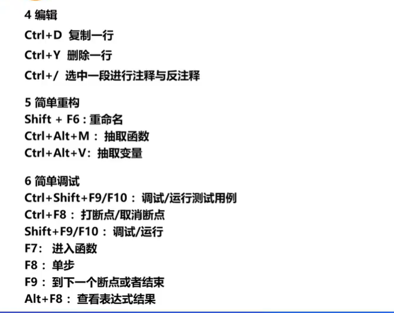

# 版本工具

- 原始版本控制

- 版本控制起源 diff 和 patch

  使用diff来对两个文件进行差异对比

  ```bash
  $ diff -u left.c right.c
  ```

  patch是diff的反向操作

  ```bash
  $ patch left.c diff.txt
  $ patch -R right.c diff.txt
  ```

- RCS（revision control system） 最早期的本地版本控制工具 。
- CVS SVN 集中式版本控制工具：存在一系列问题，如：提交排队，不能同时修改，缺乏质量控制；数据安全差，会产生单点故障，黑客攻击等问题；缺乏门禁保护，本地代码到服务器之间缺少检查防护。
- GIT 分布式版本控制工具

**分布式和集中式的区别 **：

1. 集中式记录差异 分布式记录快照
2. 集中式中央库十分脆弱，分布式中央库十分强壮

**两者各自的应用领域**：Git不适合word等二进制文档的版本控制，无细分到目录的授权。Svn不适合跨地域的协同开发，无发做到代码的高质量要求和代码门禁

# GIT基本操作

## 工作区与文件状态

**工作区**

- 版本库 ：工作区中存在隐藏目录.git。该文件夹为git的版本库，存放了git仓库中工程的所有版本数据。也称为本地仓库。

- 工作区 ：日常工作的代码文件以及文件夹
- 暂存区：一般存放在工程根目录.git/index之中，我们也成暂存区为索引

**文件状态**

+ 已提交：文件已经安全的存放于本地仓库
+ 已修改：文件遭到修改，但是没有提交保存
+ 已暂存：已修改的文件存放于下次要提交的文件清单之中

## GIT常用命令


### **git init**

https://git-scm.com/docs/git-init

用于在本地目录下新建git仓库，会生成.git文件夹

### **git clone**

https://git-scm.com/docs/git-clone

远端服务器获取某个工程需要1、git账号有访问 下载的权限 2、该工程项目的URL

### **git add**

https://git-scm.com/docs/git-add

在提交修改的文件之前需要使用add命令将文件提交至暂存区

### **git rm**

https://git-scm.com/docs/git-rm

将指定文件彻底从当前分支的缓存区删除，因此它将从当前分支的下一提交快照中删除

该操作效果等同于将文件从本地磁盘上删除，随后执行git commit

### **git mv**

https://git-scm.com/docs/git-mv

用于移动文件，也可用于重命名文件

移动文件：

```bash
git mv a.txt temp/
```

重命名文件

```bash
git mv a.txt b.txt
```

### **git diff** 

https://git-scm.com/docs/git-diff

用于比较项目之中任意两个分支（节点）之间的差异

### **git status**

显示工作目录和暂存区的状态

### **git commit**

https://git-scm.com/docs/git-commit

将暂存区的文件改动提交至本地的文件版本库

使用-m可以附带提交的信息

```bash
git commit filename -m "commit message" 
```

可以使用-a将所有的文件进行提交

```bash
git commit -am "commit message"
```

### **git log**

https://git-scm.com/docs/git-log

用于查看git的历史提交日志

### **git push**

https://git-scm.com/docs/git-push

将本地版本的分支推送到远程服务器对应版本的分支，也可以推送到不同分支名的分支

```bash
git push origin branch_name
```

banch_name是在远端服务器的分支名

```bash
git push origin branch_name:new_branch_name
```

###  **git branch**

https://git-scm.com/docs/git-branch

**可用于查看本地所有的分支**

查看远端服务器的分支

```bash
git branch -r
```

查看本地和远端服务器的分支

```bash
git branch -a
```

**在后面加上分支名可以新建分支**

### **git checkout -b**

https://git-scm.com/docs/git-checkout

用于新建分支

> git checkout -b和git branch新建分支的区别：
>
> branch在新建分支后不会切换到新的分支
>
> checkout在新建分支后会切换到新的分支

### **git branch -d/git branch -D**

删除分支。大写的D表示强制删除

可以配合-r来删除远程分支

```bash
git branch -d -r branch_name
git push origin : branch_name
```

### **git checkout branch_name**

切换分支，用官方名词表示是“检出” 可以使用-f来进行强制切换

### **git pull**

https://git-scm.com/docs/git-pull

从远端服务器取出某个分支，并与本地指定的分支进行自动合并

```bash
git pull origin remote_branch
git pull origin remote_branch:local_branch
```

###  **git fetch **

https://git-scm.com/docs/git-fetch

从远端服务器获取分支的更新到本地仓库

```bash
git fetch origin remote_branch:local_branch
```

> fetch和pull区别
>
> 可以理解为pull是fetch和merge的结合

### **git merge**

https://git-scm.com/docs/git-merge

从指定节点合并到当前分支

### **git rebase**

https://git-scm.com/docs/git-rebase

合并分支

> rebase和merge区别
>
> merge更加推荐使用，是将目的分支新增一个分支，里面有与源分支的区别
>
> rebase是直接将源分支的节点拿过来，暴力会导致日志出现问题

### **git reset**

https://git-scm.com/docs/git-reset

用于撤销当前工作区的某些commit操作

```bash
git reset commit's hashcode
```

### git checkout .

https://git-scm.com/docs/git-checkout

退回所有的修改但是未提交的文件内容

# IDEA 的使用

## IDEA快捷键





